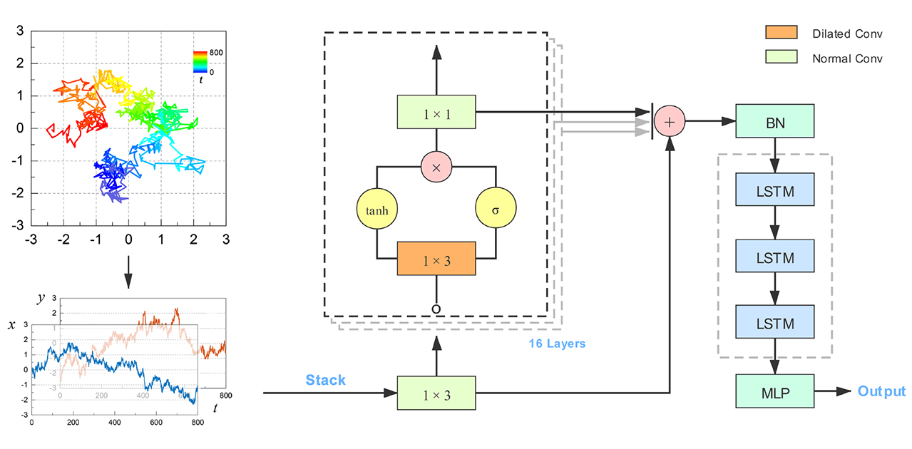

# WADNet

Codes of WADNet for training and inference.

>**Note**: For code files in this repository:
> * The prefix `inf` denotes the inference of the anomalous diffusion exponent (task 1), while `cls` denotes the classification of the diffusion model (task 2). 
> * The suffix `1d`, `2d`, `3d` denote the task dimension. 
> 
> In this instruction of codes, we take the inference task for 1D trajectory as the example, where the usage of codes is completely the same in other cases.

### WaveNet-Based Deep Neural Networks for the Characterization of Anomalous Diffusion (WADNet)

#### Dezhong Li, Qiujin Yao, [Zihan Huang](http://grjl.hnu.edu.cn/p/2020162)

School of Physics and Electronics, Hunan University, Changsha 410082, China

E-mail: huangzih@hnu.edu.cn



### 1. Data Generation
The file `inf_generate_trajectory_1d.py` is utilized to generate the training data based on the Python package [`andi_datasets`](https://github.com/AnDiChallenge/ANDI_datasets). The usage is:
```
python inf_generate_trajectory_1d.py --l 300 --N 1500000
```
where `--l` is the trajectory length and `--N` is the number of trajectories.

### 2. Model Training

The code of task 1 for training is in the file `inf_train_wavelstm_1d.py`, where the usage is:
```
python inf_train_wadnet_1d.py --l 300 --f 0
```
`--l` is the specific trajectory length and `--f` denotes the fold ranging from 0 to 4.

### 3. Inference

The codes for inference are in the file `inf_inference_1d.py`. Before running the code, make two folders `data` and `output`, then put the challenge data 'task1.txt' and 'task2.txt' into folder 'data'. After that, using the codes as:
```
python inf_inference_1d.py
```
The result will be generated in folder `output`.

### 4. System Environment
* OS: Ubuntu 16.04
* GPU: RTX 2080Ti
* Python==3.7.4
* PyTorch==1.6.0
* cuda==10.2
* cuDNN==7.6.5

### 5. References
[1] G. Muñoz-Gil, G. Volpe, M. A. Garcia-March, R. Metzler, M. Lewenstein, and C. Manzo, [AnDi: The Anomalous Diffusion Challenge](https://arxiv.org/abs/2003.12036). arXiv: 2003.12036.

[2] S. Bo, F. Schmidt, R. Eichhorn, and G. Volpe, [Measurement of Anomalous Diffusion Using Recurrent Neural Networks](https://journals.aps.org/pre/abstract/10.1103/PhysRevE.100.010102). Phys. Rev. E 100, 010102(R) (2019).

[3] G. Muñoz-Gil, et al., [Objective Comparison of Methods to Decode Anomalous Diffusion](https://arxiv.org/abs/2105.06766). arXiv: 2105.06766.
